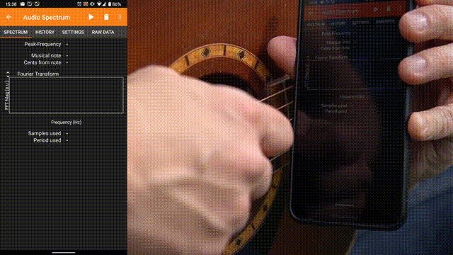
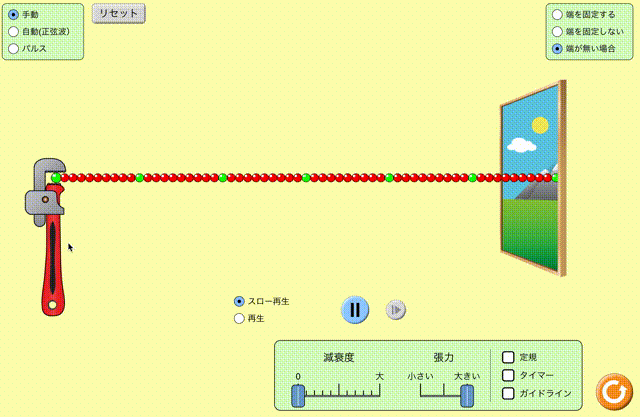

---

marp: false
header: Date
footer: Myname

---

<!-- 
theme: gaia
size: 4:3
paginate: true
style: |
  section {
    background-color: #FFFFFF;
    font-family: 'Yu Gothic UI';
    color: black;
  }
-->

<!-- headingDivider: 2 -->

<!-- _class: lead -->

# 生徒のスマートフォンを測定機として使う

## なぜスマートフォンを測定機として使うか。
* スマートフォンを測定機として使えば、個別に実験ができる
* 普段から手元にある機器なので、日常の場面でも「このアプリ使ってみよう」と思い、物理量の測定をしてみようと思えるかもしれない。
* スマートフォンになぜその測定器が付いているか考える活動も考えられる。
  * ジャイロセンサーでは、スマホの向き(縦か横か)を検知している、気圧センサーでは、高度を測定している

## 紹介するアプリ：Phyphox 

### 他のアプリに比べて良いところ
 * iphone , androidどちらでも、同じ操作感で使える
 * iphone版は、日本語対応(Androidは要確認)
 * 不適切な広告がついていない(2021/8/20現在)
    * 騒音計アプリやファンクションジェネレータなの機能がある無料アプリもあるが、学習の場面で生徒に使わせるには適切とは言えない広告(マンガ、ゲーム、アダルトなど)が表示される場合がある。
 * 一つのアプリケーションに、多くの機能がついている
    * １機能１アプリだと、生徒のスマートフォンに多くのアプリをインストールさせなくてはならない。学校から貸与しているのでなければ、スマートフォンのストレージ容量はさまざまで、学校から多くのアプリをインストールさせるのは避けたい。
      * Gsuite を本格導入している学校では、生徒のスマホにすでにGoogle Classroom、Google Drive、Gmail、Google Calendarなどたくさんのアプリのインストールを指示しているはず。
* ネット環境があれば、アプリ上で実験の説明や動画(Youtubeに移動)をみることができる。

## ダウンロードのリンク
### Google play : 
https://play.google.com/store/apps/details?id=de.rwth_aachen.phyphox&utm_source=global_co&utm_medium=prtnr&utm_content=Mar2515&utm_campaign=PartBadge&pcampaignid=MKT-Other-global-all-co-prtnr-py-PartBadge-Mar2515-1

### Apple Store:
https://apps.apple.com/jp/app/phyphox/id1127319693

## 具体例
### 音響ストップウォッチ

#### 【実践例】音速の測定

## 具体例
### 音響ストップウォッチ

#### 【実践例】落下実験

## 具体例
### 加速度計

#### エレベーターのv-tグラフ

## 具体例
### 加速度計

#### 電車のv-tグラフ
* 加速度センサーを起動したまま電車に乗る
* データをエクスポートし、積分すると比較的綺麗なv-tグラフが得られる。

## 具体例
### スペクトラムアナライザー

## 注意点
* センサーの感度や出力の大きさは機種によって違う。
* 心理的校正(後で追記します、科学をどう教えるかに書いてある、センサーの値が直感と合っていることを生徒自身が自覚する必要がある)の必要があるので、いきなり実験を行うのではなく、簡単な活動を通してセンサーの仕組みを伝えてからの方が良い
* 充電や通信量には気を使ってあげたい。
    * 学校で充電をしてはいけないという学校もあるかもしれない。ただ、物理実験室はコンセントが多くあるはずなので、学校に許可をとって、実験の前の時間に「次回の授業ではスマホを20分くらい使う、物理室の中でのみ充電を認めるので、充電器を持ってくるように」と伝えれば、トラブルは減ると思う。
    * 個人的には、一人一台とかなんとか言ってんだし学校でのスマホの充電は認めるべきだと思います。帰り道を調べたり、スマホを定期券に使っていたり、家庭との連絡のツールになっているので…。(カットします)
* 普段から、データの見方に関する指導は必要。特にデジタル測定やグラフでの表現だと、授業者にとっては「大体同じ」と感じるような差でも学習者は「変化した」と感じることも多い。

# Phetを使ったシミュレーション上での生徒実験

## なぜPhetを紹介するか
* シミュレーションだけでOKと言いたいわけではない。実物を使った実験と組み合わせることで、効果がより大きくなる。
* シミュレーションを使えば、摩擦を無視、跳ね返り係数１など、理想的な状況を表現できたり、パラメータの変更が容易にできたりする。
* さまざまな表現を切り替えられる。(あまり提示しすぎても生徒を混乱させるだけになることもあるので、演示で示す際に参考にするのがよい。)

## 実践例1
*  波：ウェーブマシーンの代わりになる、スロー再生、一時停止ができる。反射の効果を無視することができる

## 実践例2
* 運動量：多くのパラメータを変えながら、定量的な観察ができる

## 実践例3
* 電場：場のイメージを持つことができる。

## 注意が必要なところ
* 普段の実験と同じで、目的意識を持たせながら扱う必要がある。なんとなくいじるだけでは、学びは少ない。
    * Phetのサイトに無料の会員登録をすると、世界での授業実践例を知ることができる。
* スマートフォンでも使えるが、特に定量実験はできればタブレットなどの大きい画面でやりたい。
* 通信量は少なくないため、校内Wifi等の１つのアクセスポイントに同時に40人が接続をすると、通信速度が遅くなる可能性がある。実際に使う前に、各校の環境で耐えられるか、事前にテストは必要である。

