### この資料の閲覧の仕方
* キーボードの右矢印で、次のスライドに進みます。
* スマートフォンの方は、画面右下の ***>*** をクリックすると、次のスライドに進みます。
* ↓が表示されている時には、下のページにも進めます。
* escapeキーを押すと、スライド一覧が表示されます。

---

# 生徒のスマートフォンを測定機として使う

---

## Phyphox 

* スマートフォンにダウンロードして使うアプリケーションです。
* タブレットには対応していない可能性もあります。

---

## スマートフォンのアプリとは
* 一度ダウンロードすると、スマートフォン本体にアプリケーションが保存されるので、**ネットワーク環境がなくても**アプリの機能を利用できます(すべてではない)。
* 生徒はスマホの操作には慣れている場合がほとんどだと思われます。授業で使用したい時は、「phyphoxというアプリをダウンロードしてきてね」と声をかけると、ダウンロードしてきてくれます。QRコードをつけて伝えると、より親切です。

---

## ダウンロードの方法

* 以下のQRコードにアクセスしてください。

| iphone                                           | Android                                          |
| :------------------------------------------------: | :------------------------------------------------: |
| | 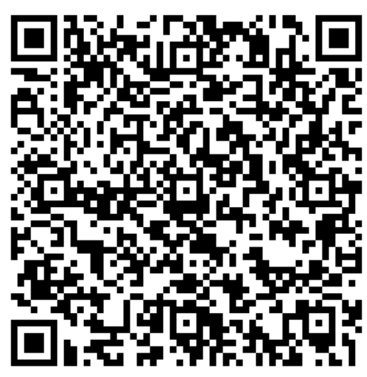|

---

## 今日紹介したいもの
* 音響ストップウォッチ
* スペクトルアナライザー
* 加速度計

---

## 音響ストップウォッチ
* 閾値以上の音が鳴ると、スタート、ストップする。

---

### 音響ストップウォッチ

#### 【実践例】落下実験

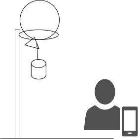

$ h = \frac{1}{2} g \Delta{t}^2 $

--

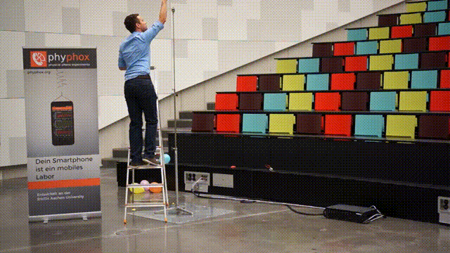

[Smartphone-Experiment: Free fall (en)](https://www.youtube.com/watch?v=zRGh9_a1J7s)

---

### 音響ストップウォッチ
#### 【実践例】音速の測定

* 2台のスマートフォンを使って実験します。

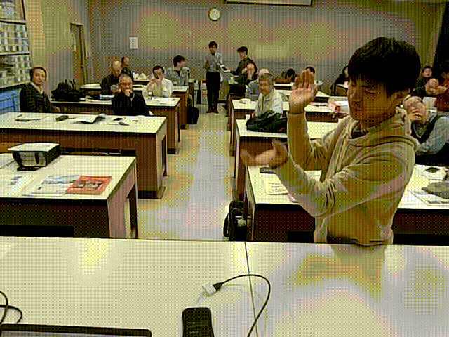

[横浜物理サークル 2020/1/19](https://www2.hamajima.co.jp/~tenjin/ypc/ypc201.htm)

--

### 概要1

| anime                                                                       | fig                                                                                   |
| --------------------------------------------------------------------------- | ------------------------------------------------------------------------------------- |
| 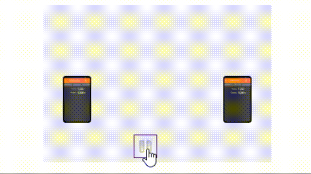 | |

--

### 概要2

| anime                                                                       | fig                                                                                   |
| --------------------------------------------------------------------------- | ------------------------------------------------------------------------------------- |
| 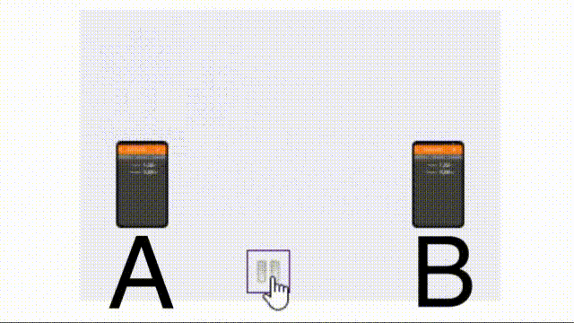 | 
|

--

### 概要3

| anime                                                                       | fig                                                                                   |
| --------------------------------------------------------------------------- | ------------------------------------------------------------------------------------- |
| 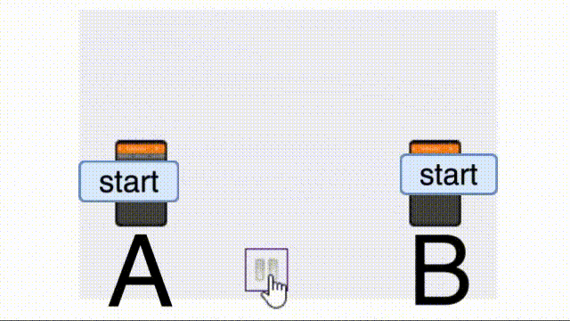 |  |

--

### まとめ 

| anime                                                                       | fig                                                                                   |
| --------------------------------------------------------------------------- | ------------------------------------------------------------------------------------- |
|  |  |

$$\Delta t_{A} - \Delta t_{B} =  \frac{2 d}{V} $$

[Messung der Schallgeschwindigkeit](https://www.leifiphysik.de/akustik/schallgeschwindigkeit/versuche/messung-der-schallgeschwindigkeit-smartphone-experiment-mit-phyphox)

---

## スペクトルアナライザー
* 周波数分析
* 周波数時系列分析
* オシロスコープとしても

---

### 加速度計

#### 電車の$v-t$グラフ
* 加速度センサーを起動したまま電車に乗る
* データをエクスポートし、積分すると比較的綺麗なv-tグラフが得られる。
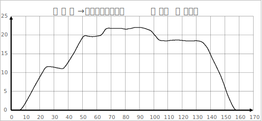

---

# スマートフォンでシミュレーション

---

## Phet

#### 注意
* アプリだと有料になります(120円)
* ブラウザで検索してアクセスすれば、無料で

---

## 実践例1
*  波：ウェーブマシーンの代わりになる、スロー再生、一時停止ができる。反射の効果を無視することができる

--

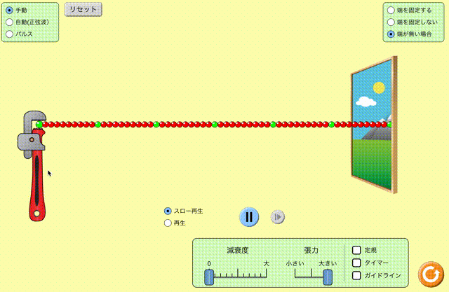

---

## 実践例2
* 運動量：多くのパラメータを変えながら、定量的な観察ができる

--

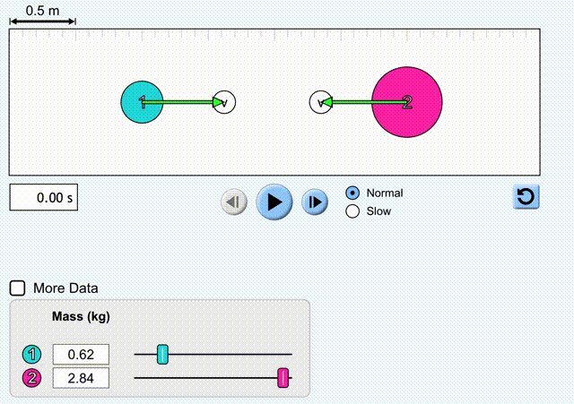

---

## 実践例3
* 電場：場のイメージを持つことができる。

--

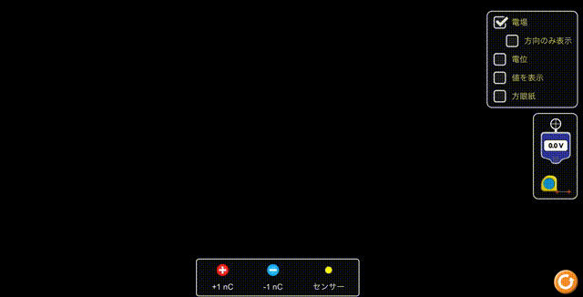

---

## 授業でより効果的に使うために
* ただ「遊ばせる」だけでは効果が少ない
* センサーやシミュレーションのどこに注目してもらいたいか、どういう手順で示すかがカギ
* これらの教材の実践例はあまりない。サークル等でぜひ、情報交換をしましょう！