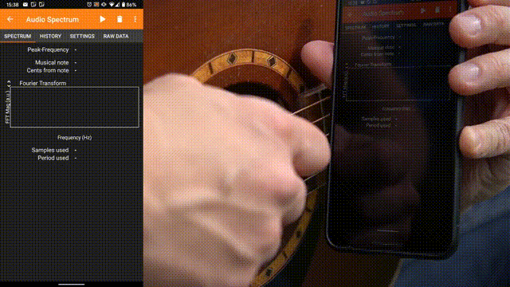

# 生徒のスマートフォンを測定機として使う

---

## 紹介するアプリ：Phyphox 

* スマートフォンにダウンロードして使うアプリケーションです。
* タブレットには対応していない可能性もあります。

---

## ダウンロードの方法

* 以下のQRコードにアクセスしてください。

| iphone                                           | Android                                          |
| :------------------------------------------------: | :------------------------------------------------: |
| | |

---

## スマートフォンのアプリとは
* 一度ダウンロードすると、スマートフォン本体にアプリケーションが保存されるので、ネットワーク環境がなくてもほとんどの機能を利用できます。
* 生徒はアプリの操作には慣れている場合がほとんどだと思われます。授業で使用したい時は、「phyphoxというアプリをダウンロードしてきてね」と声をかけると、ダウンロードしてきてくれます。QRコードをつけて伝えると、より親切です。

---

### 音響ストップウォッチ
#### 【実践例】音速の測定

---

### 音響ストップウォッチ

#### 【実践例】落下実験

---

### 加速度計

#### エレベーターのv-tグラフ

---

### 加速度計

#### 電車のv-tグラフ
* 加速度センサーを起動したまま電車に乗る
* データをエクスポートし、積分すると比較的綺麗なv-tグラフが得られる。

---

### スペクトラムアナライザー

---

# スマートフォンでシミュレーション

---

## Phet

---

## 実践例1
*  波：ウェーブマシーンの代わりになる、スロー再生、一時停止ができる。反射の効果を無視することができる

---

## 実践例2
* 運動量：多くのパラメータを変えながら、定量的な観察ができる

---

## 実践例3
* 電場：場のイメージを持つことができる。

---

