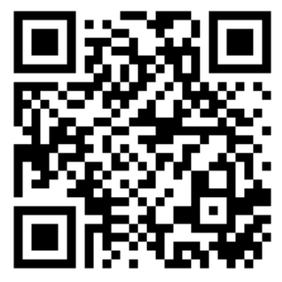

# 生徒のスマートフォンを測定機として使う

---

## 紹介するアプリ：Phyphox 

* スマートフォンにダウンロードして使うアプリケーションです。
* タブレットには対応していない可能性もあります。

---

## ダウンロードの方法

* 以下のQRコードにアクセスしてください。

| iphone                                           | Android                                          |
| :------------------------------------------------: | :------------------------------------------------: |
| | |

---

## スマートフォンのアプリとは
* 一度ダウンロードすると、スマートフォン本体にアプリケーションが保存されるので、**ネットワーク環境がなくても**アプリの機能を利用できます(すべてではない)。
* 生徒はスマホの操作には慣れている場合がほとんどだと思われます。授業で使用したい時は、「phyphoxというアプリをダウンロードしてきてね」と声をかけると、ダウンロードしてきてくれます。QRコードをつけて伝えると、より親切です。

---

## 今日紹介したいもの
* 音響ストップウォッチ
* スペクトルアナライザー

---

## 音響ストップウォッチ
* 閾値以上の音が鳴ると、スタート、ストップする。

---

### 音響ストップウォッチ

#### 【実践例】落下実験

$ h = \frac{1}{2} g \Delta{t}^2 $

--

[Smartphone-Experiment: Free fall (en)](https://www.youtube.com/watch?v=zRGh9_a1J7s)

---

### 音響ストップウォッチ
#### 【実践例】音速の測定

$\Delta t_{A} - \Delta t_{B} = 2 \frac{d}{V} $

[Messung der Schallgeschwindigkeit](https://www.leifiphysik.de/akustik/schallgeschwindigkeit/versuche/messung-der-schallgeschwindigkeit-smartphone-experiment-mit-phyphox)

--

[横浜物理サークル 2020/1/19](https://www2.hamajima.co.jp/~tenjin/ypc/ypc201.htm)

---

## スペクトルアナライザー
* 周波数分析
* 周波数時系列分析
* オシロスコープとしても

---

### 加速度計

#### 電車の$v-t$グラフ
* 加速度センサーを起動したまま電車に乗る
* データをエクスポートし、積分すると比較的綺麗なv-tグラフが得られる。

---

### 加速度計と気圧計

#### エレベーターの$v-t$グラフ

[Smartphone-Experiment: Speed of an Elevator (en)](https://www.youtube.com/watch?v=y-goBtfuXAM&t)

---

# スマートフォンでシミュレーション

---

## Phet

---

## 実践例1
*  波：ウェーブマシーンの代わりになる、スロー再生、一時停止ができる。反射の効果を無視することができる

---

## 実践例2
* 運動量：多くのパラメータを変えながら、定量的な観察ができる

---

## 実践例3
* 電場：場のイメージを持つことができる。

---

